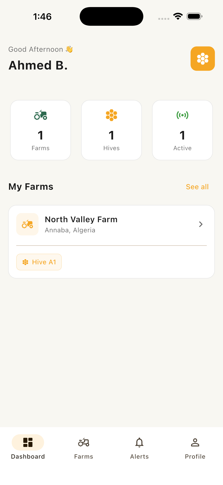

# 🐝 BeeWatch

### Smart IoT Beehive Monitoring & Management Platform

BeeWatch is a commercial IoT-powered SaaS platform designed to help beekeepers monitor hive conditions remotely, manage farms and hives, receive real-time alerts, and analyze historical hive data.

The platform combines a cross-platform mobile application, web-based administration dashboard, IoT telemetry infrastructure, subscription management, and payment processing into a unified system.

---

## ✨ Overview

BeeWatch transforms connected beehive sensors into actionable insights for beekeepers.

The platform continuously collects and processes hive telemetry such as:

- Hive weight
- Internal temperature
- External temperature
- Humidity
- Sound level
- Device battery level

Beekeepers can monitor their colonies from a mobile application while administrators can manage users, farms, subscriptions, billing, and platform activity through a dedicated web dashboard.

---

## 🎯 Product Goals

BeeWatch was designed around four main objectives:

- 📡 **Real-time monitoring** — access current hive conditions remotely.
- 🔔 **Early detection** — identify abnormal conditions through alerts.
- 📊 **Data-driven management** — understand hive behavior through historical data.
- 💳 **SaaS monetization** — provide subscription-based plans with integrated payments.

---

# 📱 Mobile Application

The BeeWatch mobile application is designed for beekeepers and farm operators.

### Core Features

#### 🔐 Authentication

- User registration
- Secure login
- Session management
- Account management

#### 🌾 Farm Management

- Create and manage farms
- Manage multiple hives
- Organize connected devices
- Monitor farm activity

#### 🐝 Hive Monitoring

Users can monitor live hive telemetry including:

| Metric | Description |
|---|---|
| Weight | Current hive weight |
| Internal Temperature | Temperature inside the hive |
| External Temperature | Ambient temperature |
| Humidity | Hive/environment humidity |
| Sound | Hive sound level |
| Battery | Device battery status |

#### 📊 Analytics

BeeWatch provides summarized and historical information such as:

- Average weight
- Average temperature
- Average humidity
- Weight ranges
- Historical measurements
- Hive trends

#### 🔔 Alerts

The platform can notify users about important hive or device conditions.

Examples include:

- Abnormal temperature
- Abnormal humidity
- Unusual weight changes
- Low battery
- Abnormal sound levels
- Device-related conditions

---

# 🖥️ Administration Dashboard

BeeWatch includes a dedicated web administration dashboard for platform operators.

### Dashboard Capabilities

- Platform overview
- User management
- Farm management
- Hive management
- Subscription management
- Billing management
- Revenue monitoring
- Alert monitoring
- Plan management
- Platform statistics

### Business Metrics

The dashboard provides visibility into metrics such as:

- Total users
- Total farms
- Total hives
- Active alerts
- New users
- Monthly recurring revenue
- Revenue by subscription plan
- Users by plan

---

# 📡 IoT Infrastructure

BeeWatch is designed around an IoT telemetry pipeline.

Connected devices collect hive measurements and transmit them to the platform.

```text
┌───────────────────────┐
│    Hive Sensors       │
│                       │
│ Weight                │
│ Temperature           │
│ Humidity              │
│ Sound                 │
│ Battery               │
└───────────┬───────────┘
            │
            ▼
┌───────────────────────┐
│    IoT Gateway        │
└───────────┬───────────┘
            │
            │ MQTT
            ▼
┌───────────────────────┐
│     MQTT Broker       │
└───────────┬───────────┘
            │
            ▼
┌───────────────────────┐
│    Backend Services   │
│                       │
│ Telemetry Processing  │
│ Alert Processing      │
│ Business Logic        │
└───────────┬───────────┘
            │
       ┌────┴────┐
       ▼         ▼
   Database   Notifications
       │
       └─────────────┐
                     ▼
              Mobile Application
```

---

# 💳 Subscription & Payments

BeeWatch follows a SaaS subscription model.

Users can subscribe to available plans and manage their subscription through the platform.

### Stripe Integration

Payment processing is implemented using **Stripe**.

The integration supports the SaaS billing lifecycle, including:

- Subscription checkout
- Recurring payments
- Subscription plans
- Payment processing
- Subscription status
- Billing events
- Payment webhooks
- Subscription lifecycle management

The backend communicates with Stripe securely and processes relevant webhook events to keep subscription state synchronized with the platform.

```text
User
 │
 ▼
Mobile / Web Application
 │
 ▼
Backend API
 │
 ▼
Stripe
 │
 ├── Checkout
 ├── Subscription
 ├── Payment
 └── Webhooks
       │
       ▼
Backend
       │
       ▼
Subscription State
```

Sensitive Stripe credentials and production payment configuration are never committed to the repository.

---

# 🐳 Containerized Backend

The BeeWatch backend is designed to run inside Docker containers.

Containerization provides:

- Consistent development environments
- Isolated services
- Reproducible deployments
- Easier infrastructure management
- Scalable service architecture
- Simplified production deployment

A typical deployment environment contains services such as:

```text
┌──────────────────────────────────────┐
│              Docker                  │
│                                      │
│  ┌──────────────┐                    │
│  │ Backend API  │                    │
│  └──────────────┘                    │
│                                      │
│  ┌──────────────┐                    │
│  │ MQTT Broker  │                    │
│  └──────────────┘                    │
│                                      │
│  ┌──────────────┐                    │
│  │ Database     │                    │
│  └──────────────┘                    │
│                                      │
│  ┌──────────────┐                    │
│  │ Supporting   │                    │
│  │ Services     │                    │
│  └──────────────┘                    │
└──────────────────────────────────────┘
```

Production secrets, credentials, certificates, and infrastructure configuration are intentionally excluded from this public repository.

---

# 🏗️ Platform Architecture

BeeWatch follows a modular architecture designed around separation of responsibilities.

```text
                    ┌───────────────────┐
                    │   Mobile App      │
                    │     Flutter       │
                    └─────────┬─────────┘
                              │
                              │ HTTPS
                              ▼
                    ┌───────────────────┐
                    │    Backend API    │
                    │    Dockerized     │
                    └─────┬─────┬───────┘
                          │     │
              ┌───────────┘     └────────────┐
              ▼                              ▼
      ┌───────────────┐              ┌──────────────┐
      │   Database    │              │    Stripe    │
      └───────────────┘              └──────────────┘
              ▲
              │
              │
      ┌───────┴────────┐
      │  IoT Pipeline  │
      │     MQTT       │
      └───────▲────────┘
              │
              │
      ┌───────┴────────┐
      │ Hive Sensors   │
      └────────────────┘

                    ┌───────────────────┐
                    │ Admin Dashboard   │
                    │      Web          │
                    └─────────┬─────────┘
                              │
                              │ HTTPS
                              ▼
                       Backend API
```

For a detailed technical architecture, see:

➡️ [`docs/architecture.md`](docs/architecture.md)

---

# 🧩 Main Platform Components

## Mobile Application

The mobile application provides the beekeeper-facing experience.

Responsibilities include:

- Authentication
- Farm management
- Hive monitoring
- Telemetry visualization
- Alerts
- Analytics
- Subscription access
- User profile

---

## Backend API

The backend acts as the central application layer.

Responsibilities include:

- Authentication
- Authorization
- User management
- Farm management
- Hive management
- Device management
- Telemetry processing
- Alert processing
- Subscription management
- Stripe integration
- API security
- Business rules

---

## IoT Layer

The IoT layer handles communication between connected hive devices and the backend platform.

Responsibilities include:

- Sensor telemetry
- Device communication
- MQTT messaging
- Device status
- Battery monitoring
- Telemetry processing

---

## Administration Dashboard

The administration dashboard provides centralized control over the SaaS platform.

Responsibilities include:

- User management
- Farm management
- Hive management
- Subscription management
- Billing
- Revenue analytics
- Alerts
- Platform monitoring

---

# 🛠️ Technology

BeeWatch is built using modern technologies suitable for mobile, SaaS, and IoT applications.

### Mobile

- Flutter
- Cross-platform architecture
- REST API integration
- Push notifications

### Backend

- API-driven architecture
- Docker containerization
- Authentication & authorization
- IoT telemetry processing
- Stripe integration

### IoT

- MQTT
- Connected sensors
- Real-time telemetry
- Device monitoring

### Payments

- Stripe
- Subscription billing
- Recurring payments
- Webhooks

### Infrastructure

- Docker
- Containerized services
- Cloud-ready deployment
- Environment-based configuration

---

# 🔐 Security

Security is considered throughout the platform architecture.

Key practices include:

- Authenticated API access
- Authorization and access control
- Secure API communication
- Environment-based secrets
- Protected payment credentials
- Stripe webhook verification
- Separation of development and production configuration
- Containerized backend services
- No production secrets committed to source control

---

# 📈 Scalability

BeeWatch is designed to support growth from individual beekeepers to larger commercial operations.

The architecture allows the platform to scale across:

- Users
- Farms
- Hives
- IoT devices
- Telemetry volume
- Subscription plans
- Administrative operations

The separation between the mobile application, backend API, IoT communication layer, payment provider, and data layer makes it possible to evolve each component independently.

---

# 📸 Screenshots

## Mobile Application

### Authentication


### Hive Monitoring


### Live Readings



---

## Administration Dashboard

### Platform Dashboard


---

# 🛍️ Commercial Product

BeeWatch is available as a commercial IoT SaaS platform.

The product includes the core architecture required to build and operate a connected beehive monitoring solution.

### Product

**BeeWatch — Complete IoT Beehive Monitoring SaaS Platform**

[View BeeWatch on Gumroad](https://mouazben.gumroad.com/l/njtkex)

---

# 📱 Availability

### iOS

Available / coming soon depending on release status.

### Android

Coming soon.

---

# 👨‍💻 Developer

**Mouaz Ben**

Software Engineer focused on building:

- Flutter applications
- SaaS platforms
- IoT systems
- Backend APIs
- Admin dashboards
- Business applications
- Cloud-ready software architectures

---

# 📄 Repository Scope

This public repository is intended as a **technical showcase and product case study**.

The production source code, infrastructure credentials, private configuration, payment secrets, and proprietary implementation details are not included.

---

## ⭐ Interested in a Similar Platform?

If you are looking to build a custom:

- IoT platform
- SaaS product
- Flutter application
- Admin dashboard
- Subscription platform
- Real-time monitoring system

feel free to get in touch.

---

**© 2026 BeeWatch. All rights reserved.**
